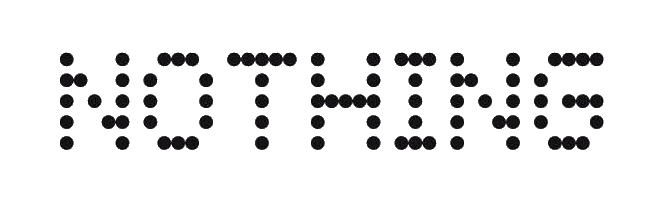

## NothingOS for Unity
This SDK provides native APIs for all of the essential Glyph features on Nothing Phone.

## Features
- glyph-based progress bars
- custom glyph animations
- supports all range of distributed devices (Phone 1, Phone 2, Phone 2a)

## What's inside?
- .NET wrapper for Unity
- native [Glyph Developer Kit](https://github.com/Nothing-Developer-Programme/Glyph-Developer-Kit) `.jar` library

#### Unity Plugin
##### via Unity Package Manager
The latest version can be installed via [package manager](https://docs.unity3d.com/Manual/upm-ui-giturl.html) using following git URL: \
`https://github.com/am1goo/NothingOS.Unity.git#1.0.1`

## Requirements
- Minimal SDK 19 (Android 4.4, KitKat)
  
## Limitations
This plugin works only on SDK 34 or newer (Android 14, Upside Down Cake), on other devices it just do nothing.

## Tested in
- Unity 2019.4.x
- Unity 2020.3.x

## Contribute
Contribution in any form is very welcome. Bugs, feature requests or feedback can be reported in form of Issues.
